<div align="center">

# Vietnamese Document OCR Serving Model - MLOps Pipeline

**Architecture-driven MLOps pipeline for Vietnamese administrative document OCR**

<p>
  
  
  
  
  
  
  
  
</p>

**Author:** Quy Dat  
**Email:** [tranquydat.work@gmail.com](mailto:tranquydat.work@gmail.com)

</div>

---

## Architecture

The diagram below is the system contract for this repository. Every major directory and runtime component maps to one block in this architecture: batch data processing, fake stream ingestion, feature storage, distributed training, model registry, deployment automation, artifact storage, Kubernetes deployment, ModelMesh serving, and the public serving API.

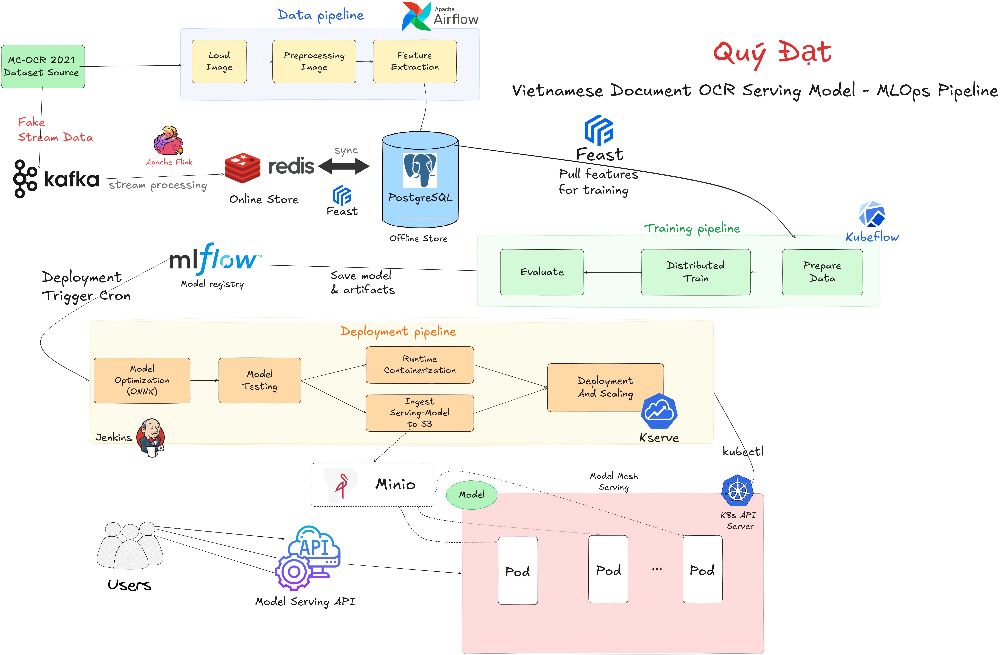

## Project Goal

This project builds a complete MLOps workflow for serving a Vietnamese document OCR model. It starts from the MC-OCR 2021 dataset, prepares features, trains OCR models, registers artifacts, optimizes models for serving, deploys them to Kubernetes, and exposes inference through a model serving API.

## Model Choice

The production OCR baseline is **PaddleOCR 3.6.0 + PaddleOCR-VL-1.6**. This version is selected because it is the strongest practical choice for document OCR in this architecture: it keeps high OCR accuracy, handles Vietnamese diacritics well through the PaddleOCR multilingual stack, and adds stronger document parsing for tables, formulas, seals, charts, and complex layouts.

| Model Stack | Release Date | Practical Rank | Accuracy | Vietnamese Text | Document Parsing | Production Decision |
|---|---|---|---|---|---|---|
| PaddleOCR 3.6.0 + PaddleOCR-VL-1.6 | 2026-05-28 | Highest practical option | Very high | Strong diacritics support | Strong parsing for complex documents | Number one production choice |

Model reference: `paddleocr==3.6.0` is pinned in `requirements.txt` and the training Docker image.

The architecture is split into five connected pipelines:

| Pipeline | Components | Responsibility |
|---|---|---|
| Data pipeline | MC-OCR 2021, Apache Airflow, PostgreSQL | Load images, preprocess them, extract features, and persist offline training data |
| Streaming pipeline | Kafka, Apache Flink, Redis, PostgreSQL | Simulate real-time document streams and synchronize online/offline stores |
| Training pipeline | Feast, Kubeflow, MLflow | Pull features, prepare training data, run distributed training, evaluate, and register artifacts |
| Deployment pipeline | Jenkins, ONNX, MinIO, KServe, Kubernetes | Optimize, test, package, upload, deploy, and scale serving models |
| Serving pipeline | MinIO, ModelMesh, pods, Model Serving API | Load model artifacts, route inference traffic, and return OCR results to users |

## End-to-End Flow

```text
MC-OCR 2021 Dataset Source
    -> Airflow Data Pipeline
    -> PostgreSQL Offline Store
    -> Feast Feature Store
    -> Kubeflow Training Pipeline
    -> MLflow Model Registry
    -> Jenkins Deployment Pipeline
    -> MinIO Model Storage
    -> KServe / ModelMesh Serving
    -> Model Serving API
    -> Users
```

The streaming branch runs in parallel:

```text
MC-OCR 2021 Dataset Source
    -> Fake Stream Data
    -> Kafka
    -> Apache Flink Stream Processing
    -> Redis Online Store
    <-> PostgreSQL Offline Store
```

## Architecture to Code Map

| Architecture Block | Repository Location |
|---|---|
| Load Image | `data_pipeline/operators/load_image.py` |
| Preprocessing Image | `data_pipeline/operators/preprocess_image.py` |
| Feature Extraction | `data_pipeline/operators/feature_extraction.py` |
| Airflow DAG | `data_pipeline/dags/ocr_data_pipeline.py` |
| Fake Stream Data Producer | `streaming/produce.py` |
| Flink Stream Processing | `streaming/flink_processor.py` |
| Kafka/Flink/Redis stack | `streaming/docker-compose.yml` |
| Kafka Connector | `streaming/kafka_connector/connect-timescaledb-sink.json` |
| Feast Feature Store | `feature_store/feature_store.yaml`, `feature_store/features/ocr_features.py` |
| Prepare Data / Distributed Train / Evaluate | `distributed_training/mwt.py`, `deployments/mwt.yaml` |
| Model Optimization (ONNX) | `distributed_training/export_onnx.py` |
| Deployment Pipeline | `Jenkinsfile` |
| Ingest Serving-Model to S3 | `api/upload_model_to_minio.py` |
| KServe Deployment and Scaling | `deployments/triton-servingruntime.yaml`, `deployments/triton-isvc.yaml` |
| Model Serving API | `api/triton_client.py` |
| Triton Model Repository | `model_repo/vn_doc_ocr_det/`, `model_repo/vn_doc_ocr_rec/` |

## Data Pipeline

The batch pipeline is orchestrated by Apache Airflow.

```text
MC-OCR 2021 Dataset Source
    -> Load Image
    -> Preprocessing Image
    -> Feature Extraction
    -> PostgreSQL Offline Store
```

| Step | Output |
|---|---|
| Load Image | Raw image records from MC-OCR 2021 |
| Preprocessing Image | Deskewed, resized, padded, normalized images |
| Feature Extraction | Extracted image features written to PostgreSQL |

Run the Airflow DAG:

```bash
airflow dags trigger ocr_data_pipeline
```

## Streaming Pipeline

The streaming branch simulates real-time image ingestion from the same dataset source.

```text
MC-OCR 2021 Dataset Source
    -> Fake Stream Data
    -> Kafka
    -> Apache Flink
    -> Redis Online Store
    <-> PostgreSQL Offline Store
```

Kafka topic monitoring:

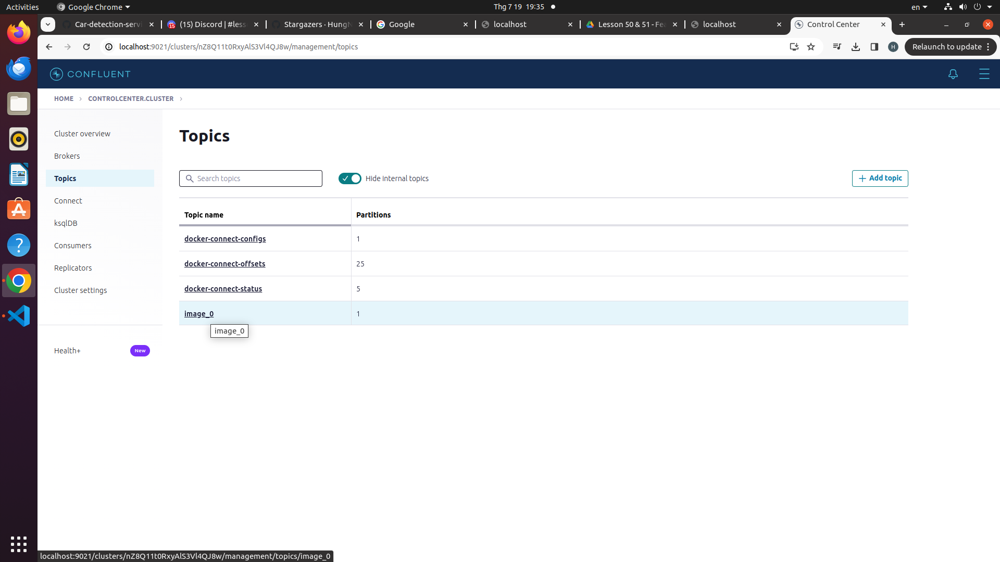

Kafka connector:

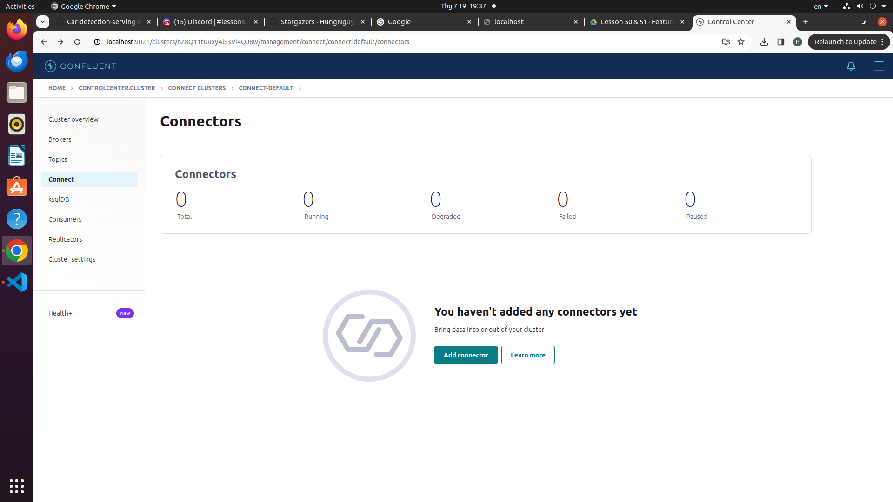

Start the streaming services:

```bash
cd streaming
docker compose up -d
./run.sh register_connector kafka_connector/connect-timescaledb-sink.json
```

Produce sample messages:

```bash
python streaming/produce.py
```

## Feature Store

Feast connects the offline and online stores to the training and serving paths.

```text
PostgreSQL Offline Store
    -> Feast
    -> Pull Features for Training
    -> Kubeflow Training Pipeline

Redis Online Store
    -> Low-latency feature access
```

| Store | Backend | Purpose |
|---|---|---|
| Offline Store | PostgreSQL | Batch feature retrieval for training |
| Online Store | Redis | Fast feature/event lookup for online workflows |

Apply feature definitions:

```bash
feast -c feature_store apply
feast -c feature_store materialize-incremental "$(date -u +%Y-%m-%dT%H:%M:%S)"
```

## Training Pipeline

The training pipeline is executed on Kubernetes through Kubeflow.

```text
Feast
    -> Prepare Data
    -> Distributed Train
    -> Evaluate
    -> Save Model and Artifacts
    -> MLflow Model Registry
```

| Step | Purpose |
|---|---|
| Prepare Data | Convert and prepare OCR data for training |
| Distributed Train | Train OCR detection and recognition models on Kubernetes |
| Evaluate | Validate checkpoints and record metrics |
| Save Model and Artifacts | Persist model outputs, metrics, and metadata |
| Register in MLflow | Keep model versions traceable for deployment |

Run the training path:

```bash
python distributed_training/mwt.py --prepare
kubectl apply -f deployments/mwt.yaml
python distributed_training/mwt.py --evaluate
```

MLflow Model Registry:


## Deployment Pipeline

Jenkins owns the serving-oriented deployment path. In the architecture, it is started by a deployment trigger cron and then prepares the model for Kubernetes serving.

```text
Deployment Trigger Cron
    -> Jenkins
    -> Model Optimization (ONNX)
    -> Model Testing
    -> Runtime Containerization
    -> Ingest Serving-Model to S3
    -> Deployment and Scaling
    -> KServe
    -> Kubernetes API Server
```

| Stage | Output |
|---|---|
| Model Optimization (ONNX) | ONNX model files compatible with the serving runtime |
| Model Testing | Verified preprocessing, model client, and streaming behavior |
| Runtime Containerization | Docker image for reproducible execution |
| Ingest Serving-Model to S3 | Model artifacts uploaded to MinIO |
| Deployment and Scaling | KServe resources applied through `kubectl` |

Jenkins dashboard:

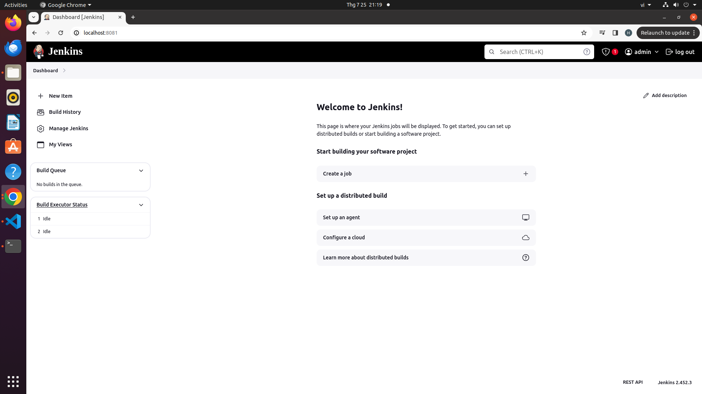

Pipeline stage view:

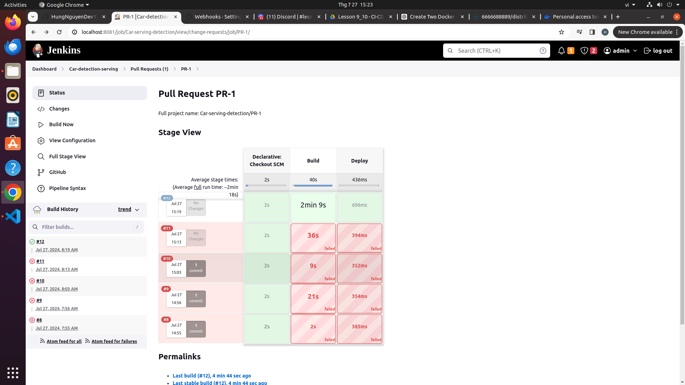

DockerHub push result:

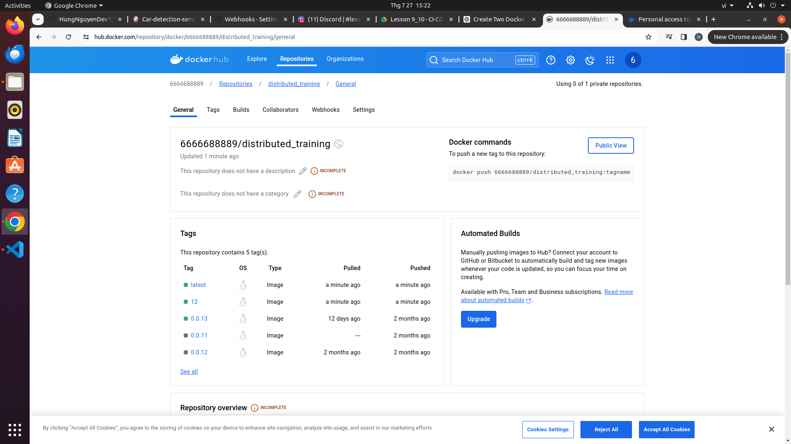

GitHub webhook connection:

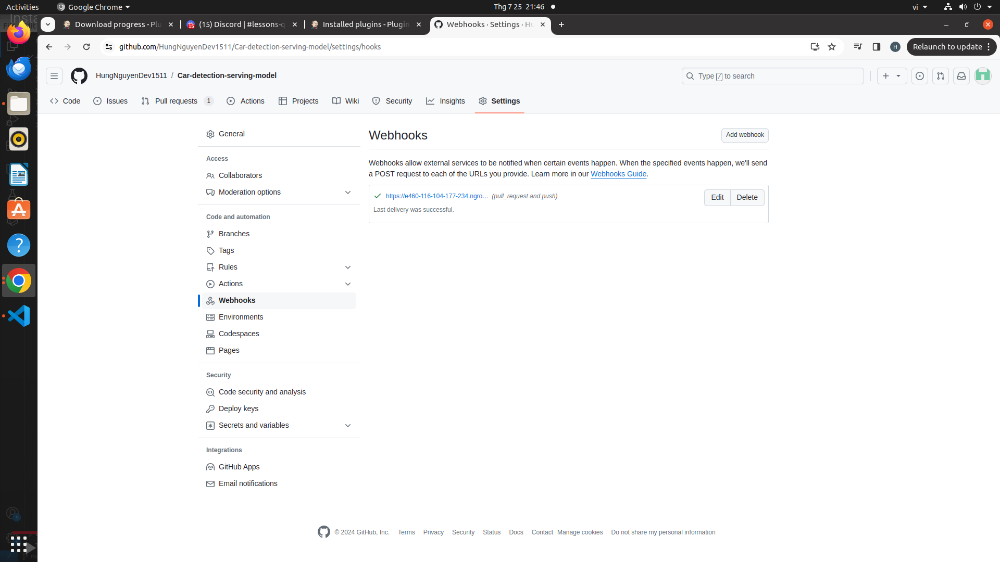

Jenkins credential setup:

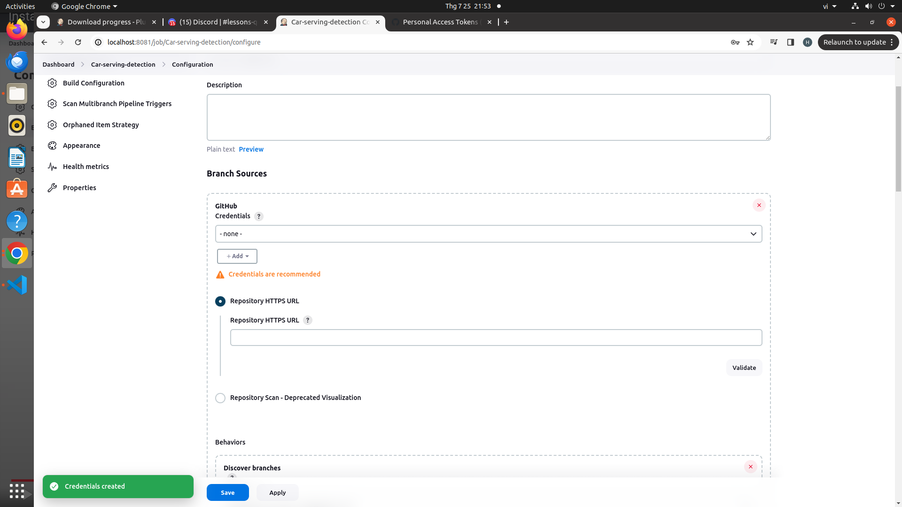

DockerHub credential setup:

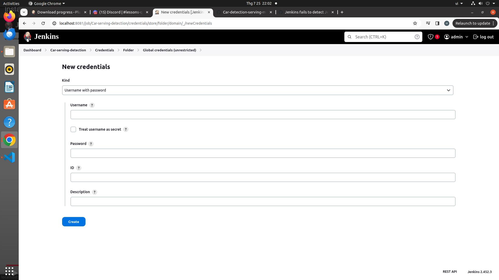

Ngrok forwarding:

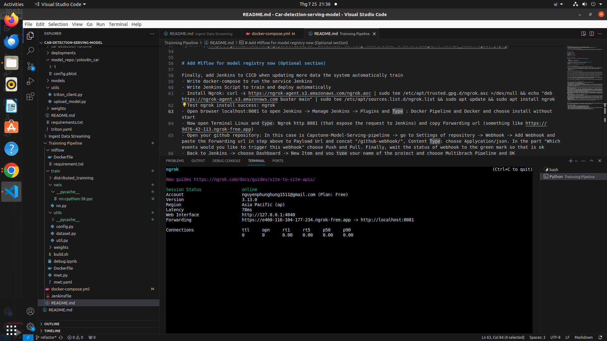

GitHub webhook setup:

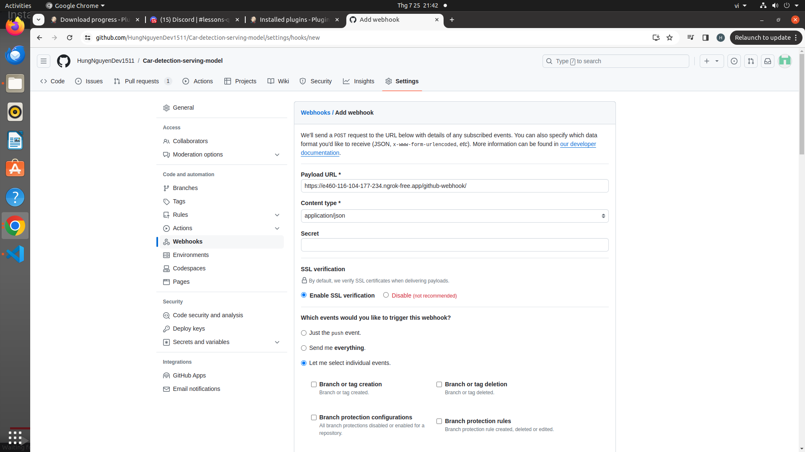

## Model Storage and Serving

MinIO stores serving artifacts. KServe deploys and scales the inference service. ModelMesh loads models from storage and routes inference traffic across serving pods.

```text
MinIO
    -> Model Artifacts
    -> ModelMesh Serving
    -> Serving Pods
    -> Model Serving API
    -> Users
```

KServe InferenceService:

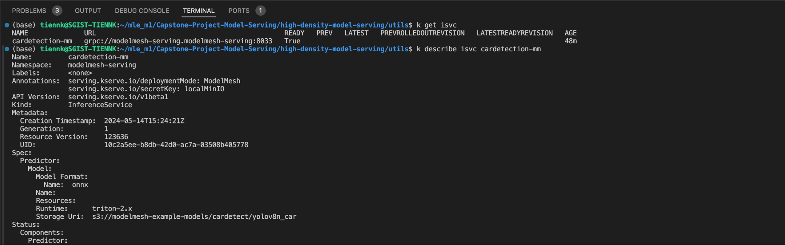

MinIO credentials:

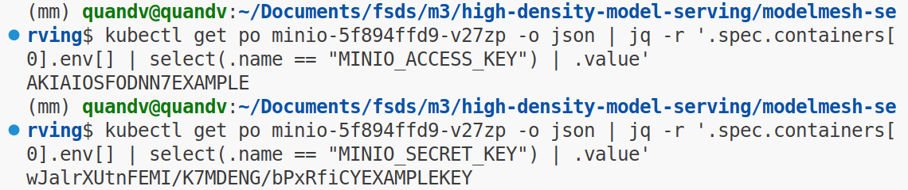

Deploy serving resources:

```bash
kubectl apply -f deployments/triton-servingruntime.yaml
kubectl apply -f deployments/triton-isvc.yaml
kubectl get isvc
```

Run OCR inference:

```python
from api.triton_client import ocr

results = ocr("path/to/vietnamese_document.jpg")
print(results)
```

Inference sequence:

```text
User Image
    -> Model Serving API
    -> Detection Model: vn_doc_ocr_det
    -> Text Region Boxes
    -> Recognition Model: vn_doc_ocr_rec
    -> CTC Decode
    -> Vietnamese OCR Result
```

## Repository Structure

```text
Vietnamese-Doc-OCR-MLOps/
|-- api/
|   |-- triton_client.py
|   `-- upload_model_to_minio.py
|-- assets/
|   `-- images/
|       `-- architecture_overview.png
|-- data_pipeline/
|   |-- dags/ocr_data_pipeline.py
|   `-- operators/
|-- deployments/
|   |-- mwt.yaml
|   |-- triton-isvc.yaml
|   `-- triton-servingruntime.yaml
|-- distributed_training/
|   |-- configs/
|   |-- export_onnx.py
|   |-- mwt.py
|   `-- utils/
|-- feature_store/
|   |-- feature_store.yaml
|   `-- features/ocr_features.py
|-- model_repo/
|   |-- vn_doc_ocr_det/config.pbtxt
|   `-- vn_doc_ocr_rec/config.pbtxt
|-- streaming/
|   |-- docker-compose.yml
|   |-- flink_processor.py
|   `-- produce.py
|-- tests/
|-- docker-compose.yml
|-- Jenkinsfile
|-- requirements.txt
`-- README.md
```

## Quick Start

Install dependencies:

```bash
git clone https://github.com/QuyDatSadBoy/Vietnamese-Doc-OCR-MLOps.git
cd Vietnamese-Doc-OCR-MLOps
python -m venv .venv
source .venv/bin/activate
pip install -r requirements.txt
cp .env.example .env
```

Start local services:

```bash
docker compose up -d
cd streaming
docker compose up -d
cd ..
```

Run tests:

```bash
pytest tests/ -v --tb=short
```

Run the model deployment flow:

```bash
python distributed_training/mwt.py --prepare
python distributed_training/export_onnx.py --all
python api/upload_model_to_minio.py
kubectl apply -f deployments/triton-servingruntime.yaml
kubectl apply -f deployments/triton-isvc.yaml
```

## Environment Variables

The environment template is available in `.env.example`.

| Variable | Description |
|---|---|
| `MLFLOW_TRACKING_URI` | MLflow tracking server |
| `TRITON_URL` | Triton HTTP endpoint |
| `MINIO_ENDPOINT` | MinIO endpoint |
| `MINIO_ACCESS_KEY` | MinIO access key |
| `MINIO_SECRET_KEY` | MinIO secret key |
| `OFFLINE_STORE_URL` | PostgreSQL offline store URL |
| `REDIS_URL` | Redis online store URL |
| `KAFKA_BOOTSTRAP_SERVERS` | Kafka bootstrap servers |
| `KAFKA_TOPIC` | Kafka topic used for OCR image messages |

## Useful Commands

```bash
# Airflow data pipeline
airflow dags trigger ocr_data_pipeline

# Kafka and Flink stack
cd streaming && docker compose up -d

# Feast feature definitions
feast -c feature_store apply

# Distributed training job
kubectl apply -f deployments/mwt.yaml

# Export ONNX models
python distributed_training/export_onnx.py --all

# Upload model artifacts to MinIO
python api/upload_model_to_minio.py

# Deploy KServe resources
kubectl apply -f deployments/triton-servingruntime.yaml
kubectl apply -f deployments/triton-isvc.yaml

# Tests
pytest tests/ -v --tb=short
```

## Notes

- `assets/images/architecture_overview.png` is the primary architecture diagram and should be updated whenever the system design changes.
- The deployment path is intentionally separated from the training path: MLflow keeps model versions traceable, while Jenkins prepares serving artifacts and deploys them.
- The streaming path is a simulated real-time branch that keeps Redis and PostgreSQL aligned for online and offline workflows.
- Do not commit real secrets in `.env`; use `.env.example` as the template.

---

<div align="center">

**Vietnamese Document OCR Serving Model - MLOps Pipeline**  
Airflow · Kafka · Flink · Redis · PostgreSQL · Feast · Kubeflow · MLflow · Jenkins · MinIO · KServe · ModelMesh

</div>
